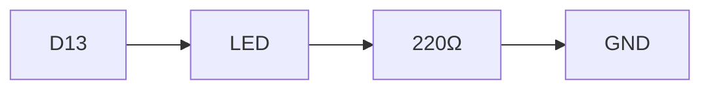

# Authoring guide

This is the full reference for writing a workshop with **workshop.ino**. For
how to clone, build and run the tool itself, see [README.md](README.md).


## Contents

- [How a participant uses it](#how-a-participant-uses-it)
- [The `content/` folder — the authoring contract](#the-content-folder--the-authoring-contract)
- [Writing a step (`.md`)](#writing-a-step-md)
- [Side quests](#side-quests)
- [Intro and outro](#intro-and-outro)
- [Attachments](#attachments)
- [Links — the "References" section](#links--the-references-section)
- [Patches — the "Code changes" section](#patches--the-code-changes-section)
- [Applying changes on the device](#applying-changes-on-the-device)
- [Live editing](#live-editing)
- [From an event agenda to a workshop](#from-an-event-agenda-to-a-workshop)

A complete worked example lives in [content/](content/) — a small Arduino "blink an LED" workshop that exercises every feature (intro, two milestones, multi side-quest, outro with its own side quest, Mermaid, code blocks with copy, inline SVG, attachments, and a patch). Copy it as a template.


workshop.ino runs on the participant's own device — an ARM64 SBC such as the
**Arduino Uno Q** or **Ventuno Q** — and the participant opens the handbook in a
browser there. Applying a step's **solution** acts on the Arduino app living on that
device (under `/home/arduino/ArduinoApps`), so a click in the browser actually changes
the code the participant is building.

- Opens the URL → lands on the **workshop overview** (Intro → milestones → Outro), with a completion tick on each step they've already visited.
- Clicks a step. The **progress bar** in the header tracks milestone checkpoints (purely client-side, in `localStorage`).
- **← / →** keys move between steps (Up/Down are left alone for scrolling).
- Per-step affordances:
  - Code blocks have a **Copy** button on hover.
  - **◇ Side quests** are optional detours linked at the bottom of the step.
  - **Code changes** is a collapsible section showing a pretty-printed diff per file —
    *what to edit* between steps, for participants who want to make the changes
    themselves. Clicking a file name downloads the raw `.patch`. (Display only; there
    is no apply button here.)
  - **Attachments** are downloadable files. One flagged as a **solution** also gets an
    **Apply** button — the easy path — that replaces the whole app folder with the
    archive's contents (clicking its name still just downloads it).
  - **References** is a list of external links for further reading; external URLs open in a new tab.
- A **Reset progress** button on the overview clears their `localStorage`.

Everything is served and applied on the device itself, so the whole workshop works fully offline.


## The `content/` folder — the authoring contract

**Structure is the workshop.** A top-level folder is a *milestone*; a `.md` file
inside it is a *step* (one checkpoint). Two reserved folder names — `intro` and
`outro` — give you the framing pages.

```
content/
  workshop.yaml          ← optional (workshop title + subtitle)
  intro/                 ← optional opener (folder named exactly "intro")
    01-welcome.md
    01-welcome.side.md   ← intros can have side quests too (optional)
  01-setup/              ← milestone 1 (numeric prefix sets order)
    01-install.md        ← step 1 of milestone 1
    02-connect.md        ← step 2
  02-blink/              ← milestone 2
    01-wire-led.md
    01-wire-led.side/    ← side-quests folder for the step (multiple, ordered)
      01-resistor-math.md
      02-rgb-bonus.md
    02-upload.md
    02-upload.side.md    ← shorthand: a single side quest
    blink.patch          ← referenced from 02-upload.md as a patch
    blink-solution.ino   ← referenced from 02-upload.md as an attachment
  outro/                 ← optional closer
    01-next-steps.md
    01-next-steps.side.md ← outros can have side quests too (optional)
  assets/                ← optional shared resources (see below)
    wiring.svg
```

### Ordering by numeric prefix

Both milestone folders and step files use a leading number to set their order:

- `01-setup/`, `02-blink/`, `10-deploy/` — sorted by the integer value of the prefix (so `10-` comes after `2-`, not before).
- Inside a milestone, `01-install.md`, `02-connect.md`, …
- The prefix is **stripped from the displayed title** (`01-setup` → "Setup", `02-wire-led.md` → "Wire The Led" unless overridden by frontmatter).

### Unprefixed top-level folders are not milestones

A top-level folder without a numeric prefix (e.g. `assets/`, `images/`) is **ignored as a milestone** — it's there to hold shared resources you reference from your steps. The only exceptions are the literal names `intro` and `outro`.

### `workshop.yaml`

Optional, at the root of `content/`:

```yaml
title: Arduino Blink Workshop
subtitle: From zero to a blinking LED
app: blink          # default Arduino app a step's solution is applied to
```

If absent, the workshop title falls back to the folder name. `app` names the folder
under the apps root (`~/ArduinoApps` by default) that a step's solution replaces; a step can override
it (see the frontmatter table below and [Applying changes on the device](#applying-changes-on-the-device)).


## Writing a step (`.md`)

Every step is plain **GitHub-flavored Markdown** with an optional YAML frontmatter block at the top. The page chrome (the title and "Milestone N · Step M" eyebrow) is drawn around your content, so **don't repeat the step title as a `# Heading` inside the body** — start straight with the content.

### Frontmatter

```yaml
---
title: Wire the LED
summary: Build the circuit on a breadboard.
app: blink                       # overrides the workshop-level app for this step
attachments:
  - path: ./blink-starter.ino
    label: Starter sketch
    description: The empty sketch you'll fill in.
  - path: ./blink-solution.zip
    label: Solution
    solution: true               # adds an "Apply" button (see Attachments)
  - path: ../assets/wiring.svg
    label: Wiring diagram (SVG)
patches:
  - path: ./blink.patch
    label: From starter to blinking
    description: The changes since the previous step.
links:
  - url: https://docs.arduino.cc/learn/microcontrollers/digital-pins/
    label: Digital pins — Arduino docs
    description: How HIGH/LOW, inputs and outputs work on Arduino pins.
---
```

All keys are optional:

| Key           | What it does                                                                 |
|---------------|------------------------------------------------------------------------------|
| `title`       | Header title. Falls back to the de-prefixed filename ("Wire The Led").       |
| `summary`     | One-liner shown on the overview card.                                        |
| `app`         | Arduino app this step's solution is applied to; overrides the workshop-level `app`. See [Applying changes on the device](#applying-changes-on-the-device). |
| `attachments` | Downloadable files. Rendered at the bottom of the step. An entry with `solution: true` also gets an Apply button. See [Attachments](#attachments). |
| `patches`     | `.patch` files rendered in the collapsible "Code changes" section. See [Patches](#patches--the-code-changes-section). |
| `links`       | External references for further reading. Rendered as a "References" list. See [Links](#links--the-references-section). |

### Path resolution (attachments, patches, images)

Paths are **relative to the step's own `.md` file**. You can reach into sibling folders with `../`, but you can't escape the content root — the download handler rejects traversal. So both of these work:

```yaml
attachments:
  - path: ./starter.zip            # co-located next to the step
  - path: ../assets/diagram.png    # shared assets folder at content root
```

Inline Markdown image links use the same rule:

```markdown

```

The server rewrites those `src`s to safe `/dl/…` URLs at render time, so the participant's browser fetches them through the same guarded handler.

### Code blocks

Fenced code blocks with a language tag are **highlighted server-side** (no extra JS loaded on the client). Each block gets a **Copy** button on hover.

````markdown
```c
const int LED_PIN = 13;
void setup() { pinMode(LED_PIN, OUTPUT); }
```
````

Inline code uses backticks: `` `pinMode(13, OUTPUT)` ``.

### Mermaid diagrams

A fenced block tagged `mermaid` is rendered client-side by the bundled Mermaid library:

````markdown

````

Mermaid is large (~3 MB), so the bundle is loaded **only on pages that contain a diagram**.

### Inline images, lists, tables, callouts

Standard GitHub-flavored Markdown:

- Lists, tables, blockquotes, inline images all work.
- Headings inside the body are styled (H2 gets a hairline rule).
- `> Tip: …` blockquotes are a nice way to add asides.


## Side quests

A side quest is an **optional detour** off a step — extra context, a deeper dive, or a stretch challenge. Side quests can be attached to **any** step, including intro and outro steps. Two ways to attach one:

**1. Shorthand — one side quest per step.** Place a sibling file named `<step>.side.md`:

```
01-setup/
  02-wiring.md
  02-wiring.side.md
```

**2. Folder form — many ordered side quests per step.** Place a sibling folder named `<step>.side/` with numerically-prefixed `.md` files:

```
02-blink/
  01-wire-led.md
  01-wire-led.side/
    01-resistor-math.md
    02-rgb-bonus.md
```

If both exist, the folder wins. Side quests appear as **◇ Side quests** links at the bottom of the parent step; each side quest page has a "Back to {step}" link. **Side quests don't count toward the progress percentage** — participants can skip them freely.


## Intro and outro

Folders literally named `intro` and `outro` (case-insensitive) are special:

- Intro appears **before** the first milestone, outro **after** the last one.
- They contain `.md` step files just like milestones do.
- Their steps **don't count toward the progress percentage**.
- They support **side quests** with the same conventions as milestone steps
  (shorthand `<step>.side.md` or a `<step>.side/` folder).
- The first intro step's **Prev** button and the last outro step's **Next**
  button both link **home** (the overview), so the workshop forms a clean cycle.

Use the intro to set the scene ("what you'll build today, how this handbook works") and the outro to wrap up ("where to go from here", "more projects to try" as an outro side quest, …).


## Attachments

Listed at the bottom of a step, each with the label (falling back to the filename) and an optional description.

```yaml
attachments:
  - path: ./blink-solution.ino
    label: Solution sketch
    description: The finished blink, if you get stuck.
  - path: ./blink-solution.zip
    label: Solution
    description: Apply this to jump straight to a working app.
    solution: true
  - path: ../assets/handout.pdf
    label: Printable wiring guide
```

Clicking an attachment's **name always downloads it**. The handler refuses any path that would escape the content root.

### Solutions

An attachment flagged `solution: true` is an archive (`.zip` or `.tar.gz`) holding a
whole, working app folder. In addition to downloading, it renders an **Apply** button
that **replaces** the target app's contents with the archive (existing files are wiped
first, then the archive is extracted). It's the easy path: a participant who doesn't
want to follow the diffs by hand — or who fell behind — applies the solution and is
instantly at a known-good state. Apply acts on the step's `app` (see [Applying changes
on the device](#applying-changes-on-the-device)); without a configured app, a solution
is download-only. Build one with, e.g., `zip -r solution.zip .` or
`tar czf solution.tar.gz .` from inside the app folder.


## Links — the "References" section

Use `links:` to point participants at further reading — official docs, blog posts, datasheets, video walkthroughs, Wikipedia articles. References are rendered as a list below the Attachments section, each item prefixed with an external-link icon.

```yaml
links:
  - url: https://docs.arduino.cc/learn/microcontrollers/digital-pins/
    label: Digital pins — Arduino docs            # optional; falls back to the URL itself
    description: How HIGH/LOW, inputs and outputs work on Arduino pins.   # optional
  - url: https://en.wikipedia.org/wiki/Light-emitting_diode
    label: Light-emitting diode — Wikipedia
    description: Why LEDs need a current-limiting resistor.
```

Behavior:

- **External URLs** (`http://`, `https://`, `//…`, `mailto:`) open in a **new tab** with `rel="noopener noreferrer"`.
- **Internal / relative URLs** (e.g. `/s/01-setup/02-wiring` for a cross-link to another step) stay in the same tab.
- If `label` is omitted, the URL itself is shown as the link text.
- Links are purely a reading list — they aren't tracked by the progress bar and aren't subject to the download-handler's path guard (they're authored URLs, not file paths).


## Patches — the "Code changes" section

When a step builds on code from the previous step, a `.patch` file lets you **show what changed** in-page. Generate one however you like — `diff -u old new` or `git diff > step3.patch` both work. Reference it from frontmatter:

```yaml
patches:
  - path: ./blink.patch
    label: From starter to blinking            # optional heading
    description: The changes since last step   # optional one-liner
```

What participants see:

- A **collapsible** *Code changes* section (hidden by default) sitting just above Attachments.
- When expanded, each file touched by the patch appears in its own card with:
  - A status badge — `modified` / `added` / `deleted` / `renamed`.
  - The file path, which is a **download link for the raw `.patch`**.
  - **+N −M** added/removed counts.
  - The hunks, with line-numbered, color-coded add/remove lines.

Code changes are **display only** — they show participants exactly what to edit if they
want to make the changes by hand. There is no apply button here: applying changes is the
job of the step's **solution** attachment (see [Solutions](#solutions)), which gets a
participant to the same end state in one click. A patch that touches several files
renders each file separately. (Diffs are parsed and rendered with
[go-gitdiff](https://github.com/bluekeyes/go-gitdiff) — workshop.ino never shells out to
apply patches.)


## Applying changes on the device

workshop.ino runs on the participant's device, so applying a **solution** operates
directly on the Arduino app there — server-side on the SBC, even though the click comes
from the browser.

**Resolving the target app.** For any step, the app is its frontmatter `app:` if set,
otherwise the workshop-level `app:` from `workshop.yaml`. It resolves to a folder under
the apps root — `~/ArduinoApps/<app>` by default (`$HOME/ArduinoApps`, falling back to
`/home/arduino/ArduinoApps` when `$HOME` is unset), configurable with the
`-apps` flag (handy for testing on a dev machine). The app name must be a single safe
path segment; anything with separators or `..` is rejected.

**Apply** (`POST /apply-solution`) wipes the app folder's contents and extracts the
solution archive (`.zip` / `.tar.gz`, auto-detected; archive entries that would escape
the folder are rejected). Extraction is pure Go — no external tools. The browser only
sends the step path and the attachment's index; the server re-derives every filesystem
path from the trusted content model, so a page can never point the action at an
arbitrary file.

**Requirements.** Apply reads/writes the apps root (`~/ArduinoApps`, or `/home/arduino/ArduinoApps`
on the device / under Docker). The **native binary /
systemd service** has that access out of the box; the sample Compose file bind-mounts the
host folder into the container read-write, so Apply works under Docker too. Either way the
target is confined to a single named folder under that root — the app name is validated to
one safe path segment, so a solution can never be applied outside the apps directory.


## Live editing

Content is read from disk **on every request**. That means:

- Edit a typo in a `.md` while the server is running → refresh → done.
- Change a `.patch` → refresh → the new diff renders.
- Add, rename or reorder a step or milestone → refresh → it appears.

No rebuild, no restart. (Templates, CSS and JS *are* embedded in the binary, so changes to those — usually only relevant if you're hacking on workshop.ino itself — do need a rebuild.)


## From an event agenda to a workshop

The playbook for turning a workshop agenda into a `content/` tree:

1. **List the milestones.** What are the 2–5 things participants will have accomplished by the end? Each becomes a numbered folder: `01-setup/`, `02-…/`, `03-…/`. Keep the milestone titles outcome-oriented ("Blink an LED", not "Hardware section").

2. **Break each milestone into steps.** A step is **one checkpoint** — usually 5–15 minutes of work. Each becomes a numbered `.md` inside the milestone folder. Aim for 2–5 steps per milestone.

3. **Write each step page** as plain Markdown:
   - Start with a short paragraph: what this step is about and *why*.
   - Add a diagram (Mermaid) or image where it helps.
   - Put the code or commands in fenced blocks with a language tag — they get syntax highlighting and a Copy button for free.
   - End with a clear checkpoint sentence: "**Checkpoint:** your LED is blinking once per second."

4. **Add detours as side quests** (`<step>.side.md` or `<step>.side/<N>-<slug>.md`) for material that's interesting but optional — historical context, deeper theory, exploration, bonus challenges. These work on any step, including intro and outro.

5. **Frame the workshop** with `intro/` (what we're building, what to expect, how to use the handbook) and `outro/` (next steps, links to dig deeper). An outro side quest like "More projects to try" is a nice way to send people home with something to keep playing with.

6. **Carry code forward with patches and solutions.** When a step builds directly on the previous one, drop a `.patch` next to it (e.g. `diff -u step2.ino step3.ino > step3.patch`) and reference it via `patches:` — participants get a "Code changes" section showing exactly what to edit. Then add a `solution: true` archive attachment (e.g. `zip -r solution.zip .` from the finished app) so anyone who'd rather skip the manual edits, or who fell behind, can **Apply** the solution and land on a working app in one click. Applying needs the workshop's `app:` set.

7. **Add shared resources** under an unprefixed folder like `content/assets/` (diagrams, hand-outs, large reference files) and link to them with `../assets/…` from any step. They can be placed anywhere in the content directory, just remember to set the paths accordingly.

8. **Run it locally** with `go run . -content ./content`, click through end to end, fix typos live. There is no build step in your authoring loop.
