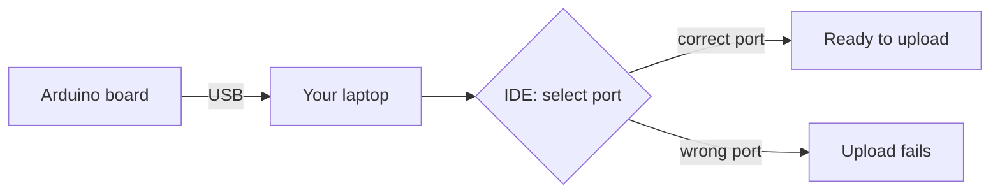

Connect the Arduino to your laptop with a USB cable. The IDE talks to the board
through a serial port, which you must select.

In the IDE, choose **Tools → Board** (your model) and **Tools → Port** (the one that
appears when you plug the board in).

**Checkpoint:** the board model and a port are both selected.
