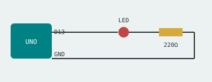
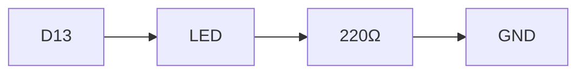

Build this circuit: pin **D13** → LED (long leg) → **220Ω resistor** → **GND**.



The current path, in order:



We declare which pin drives the LED. In the next step we'll make it blink:

```c
const int LED_PIN = 13;   // built-in LED
```

> ◇ Curious why the resistor matters, or how to drive an RGB LED? Check the side
> quests below before moving on.

**Checkpoint:** your circuit matches the diagram.
