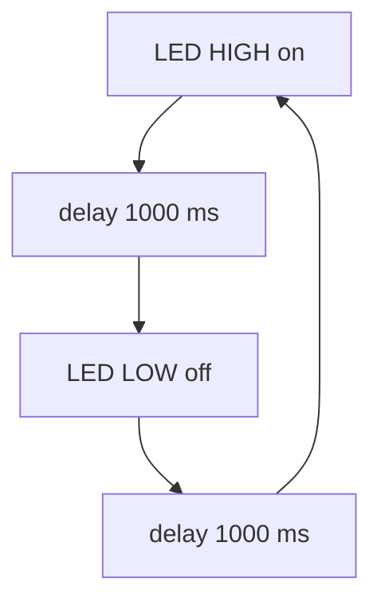

Fill in the starter sketch so the LED turns on for a second, then off for a second,
forever:

```c
const int LED_PIN = 13;

void setup() {
  pinMode(LED_PIN, OUTPUT);
}

void loop() {
  digitalWrite(LED_PIN, HIGH);
  delay(1000);
  digitalWrite(LED_PIN, LOW);
  delay(1000);
}
```

What `loop()` does, over and over:



Click **Upload** (the arrow). After it compiles and flashes, the LED blinks 🎉.

**Checkpoint:** your LED is blinking once per second.
